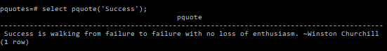

# PQuotes
Python Interoperability with PostgreSQL <br/>

## What is PQuotes by the way?
1. P stands for "Python". <br/>
2. Quotes for "Famous Quotations". <br/>

## Got that ... but what's this project about?
It's a function that prints a fuzzy quote from a corpus of Famous Quotes given your input word! <br/>

## Hmmm .... could you elaborate? Please ......?
Let's take an example .... <br/>
Let's say you want to get a quote on the keyword .... "Success" <br/>
So, you feed that into the function and it does a fuzzy match on the corpus of quotations and returns a random highest probability one based on the input word! <br/>

## OK .... but what is Fuzzy by the way?
Think of it as an Intelligent way to pick a quote based on the most relevance w.r.t the input word. <br/>
i.e. The one with the highest score or match probability is returned. <br/>

## Alright! So how do I run this thing? Anyways?
It's pretty simple actually! <br/>
Just follow the steps below: <br/>

## STEPS to get this up and running .....
## Install the Pre-Requisites:
1. Install the latest (v14.3) of PostgreSQL for Windows from here ... https://www.enterprisedb.com/downloads/postgres-postgresql-downloads <br/>
2. During the Installation select the option of Installing the v2 Language Pack using Stack Builder as described here .... https://www.enterprisedb.com/docs/epas/latest/language_pack/02_installing_language_pack/ <br/>
## Setup the Environment:
1. Ensure that the environment variables on your Windows 10 machine is setup as below:
```
Path=C:\edb\languagepack\v2\Python-3.9;[Other Path variables]
PYTHONPATH=C:\edb\languagepack\v2\Python-3.9
PYTHONHOME=C:\edb\languagepack\v2\Python-3.9\Lib
```

2. Restart your PostgreSQL 14.3 Server from Services MMC in Windows 10. <br/>

## Create the Database
1. ```psql -h localhost -U postgres``` <br/>
Enter Your Password when Prompted for ..... <br/>
2. ```create database pquotes;``` <br/>
Now ```\q``` to exit from the newly created database. <br/>

## Install the Python Extension
1. ```psql -h localhost -U postgres -d pquotes``` <br/>
2. ```CREATE EXTENSION plpython3u;```
3. ```Select * from pg_available_extensions;``` <br/>
To see if plpython3u (python 3.9) has been installed and enabled in your database. <br/>

## Install the Python Function in the Database
1. Ensure you are now in the Root Folder of this Repository in your local machine. <br/>
Then Run the command below ..... <br/>
2. ```psql -h localhost -U postgres -d pquotes -f PQuotes.sql``` <br/>

## Install the missing dependencies
1. Ensure you are in the edb languagepack python 3.9 folder ... <br/>
2. ```cd "C:\edb\languagepack\v2\Python-3.9"```
3. ```pip3 install fuzzywuzzy``` <br/>
That's it! You're Python dependencies are now setup!! <br/>


## Run the Function Now
1. ```psql -h localhost -U postgres -d pquotes```
2. ```select pquote('Success');``` <br/>
Now you must see the quote appear in the results tab below in psql ... <br/>

## That's it! ..... Here's a visual to get you started!


## Caveats
There is a random shuffle in the python code's logic to break a tie and return you fresh quotes in case of a dreadnought!!! <br/>

## Conclusion
We were Successfully able to create a Python based Function in PostgreSQL 14.3 with Language Pack v2! <br/>

## Next STEPS
Go through the Sql Python Code and try to improvise & enhance it! <br/>
Play around and extend it ... to add a new Dimension to the functionality on your machine ... !!! <br/>

## It's a Wrap!!
That brings us to the end of this particular project!! <br/>
With that, we bid adieu!!! <br/>
& <br/>
Happy Coding !!!! <br/>
